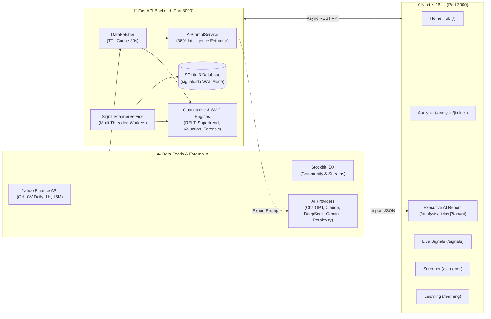

<div align="center">

# ⚡ IDX TERMINAL
### *Pro Algorithmic Market Intelligence, Smart Money Concepts & AI Multi-Model Research Hub*

[](https://www.python.org/)
[](https://fastapi.tiangolo.com/)
[-000000?style=for-the-badge&logo=next.js&logoColor=white)](https://nextjs.org/)
[](https://react.dev/)
[](https://www.sqlite.org/)
[-0052CC?style=for-the-badge&logo=tether&logoColor=white)](https://www.idx.co.id/)
[](LICENSE)

<br/>

**Platform Intelijen Pasar Finansial Kuantitatif Generasi Baru untuk Seluruh Emiten di Bursa Efek Indonesia (BEI / IDX).**  
*Menggabungkan Analisis Multi-Timeframe, Smart Money Concepts (SMC), Pemindai Sinyal 1-Jam Realtime, Model Skoring 10-Faktor, Forensik Laba (Piotroski & Beneish), Jembatan Komunitas Stockbit, serta Engine Prompt AI 360° dengan Dashboard Riset Standar Institusi.*

---

[⚡ 1-Click Quickstart](#-1-click-quickstart-cara-menjalankan-termudah) •
[🌟 Fitur Unggulan](#-fitur-unggulan-key-features) •
[🤖 AI Analyst Engine](#-ai-analyst--prompt-intelligence-hub) •
[📐 Algoritma Kuantitatif](#-algoritma-kuantitatif--manajemen-risiko) •
[🏛️ Arsitektur Sistem](#️-arsitektur-sistem) •
[📚 Dokumentasi Lengkap](#-dokumentasi-lengkap-documentation-suite)

</div>

---

## ⚡ 1-Click Quickstart (Cara Menjalankan Termudah)

Anda dapat langsung menjalankan **IDX Terminal** dalam hitungan detik menggunakan script otomatis di Windows:

```
┌─────────────────────────────────────────────────────────────────────────────┐
│                          🚀 CARA PALING CEPAT (1-KLIK)                       │
│                                                                             │
│   1. Double-Click berkas: setup.bat   (Hanya jika pertama kali menginstall)  │
│   2. Double-Click berkas: run.bat     (Untuk menjalankan seluruh aplikasi)   │
│                                                                             │
│   👉 Web Browser akan siap di: http://localhost:3000                        │
└─────────────────────────────────────────────────────────────────────────────┘
```

<details>
<summary><b>🔍 Penjelasan Detail Langkah Demi Langkah (Klik untuk membuka)</b></summary>

### Opsi A: Menggunakan Batch Script Windows (Otomatis & Direkomendasikan)
1. **Instalasi Pertama Kali**:
   - *Double-click* [`setup.bat`](file:///c:/technical-automatic/setup.bat).
   - Skrip akan otomatis memeriksa Python & Node.js, membuat environment `backend/venv`, menginstall seluruh dependensi `requirements.txt`, dan menjalankan `npm install` pada frontend.
2. **Menjalankan Aplikasi**:
   - *Double-click* [`run.bat`](file:///c:/technical-automatic/run.bat).
   - Skrip akan otomatis membersihkan port lama (:8000 & :3000), mengaktifkan server backend FastAPI di port 8000, dan menyalakan frontend Next.js di port 3000 dalam 2 jendela terpisah.
   - Buka browser Anda di: **`http://localhost:3000`**.

---

### Opsi B: Menjalankan Secara Manual via Terminal CLI
Jika Anda menggunakan macOS/Linux atau ingin kontrol manual:

```bash
# 1. Jalankan Backend (FastAPI)
cd backend
python -m venv venv
# Aktifkan venv: source venv/bin/activate (Linux/Mac) atau venv\Scripts\activate (Windows)
pip install -r requirements.txt
uvicorn main:app --reload --port 8000

# 2. Jalankan Frontend (Next.js) pada terminal terpisah
cd frontend
npm install
npm run dev
```
</details>

> [!TIP]
> **Swagger Interactive API Documentation** otomatis tersedia di [`http://localhost:8000/docs`](http://localhost:8000/docs) saat backend berjalan.

---

## 🌟 Fitur Unggulan (Key Features)

| Kategori Fitur | Kemampuan Utama |
| :--- | :--- |
| **🤖 360° AI Analyst Engine** | Ekstraksi 100% data kuantitatif komprehensif (Finansial 4-Tahun, Piotroski 9-Poin, Beneish M-Score, Order Blocks, Level Pivot Fibonacci, 15 Berita terkini) dengan 1-Klik Launcher ke 5 Provider AI (**ChatGPT, Claude, DeepSeek, Google Gemini, Perplexity**), kustomisasi posisi modal (*Average Price & Floating PnL*), serta rendering otomatis **Executive Research Dashboard** dengan *Radial Conviction Gauge (0-100)*. |
| **🔗 Stockbit Adaptive Bridge** | Tombol 1-klik adaptif di Header, Breadcrumb, dan Drawer Profil untuk langsung membuka stream diskusi komunitas, sentimen ritel, dan keterbukaan informasi emiten di **Stockbit** (`https://stockbit.com/symbol/{TICKER}`). |
| **📡 Live Signal Scanner** | Pemindai 800+ saham otomatis dengan filter tren ketat (*Strict Trend Regime*), area entri 1-Jam presisi (*1H Entry Area*), dan rekam jejak backtest win rate transparan. Dilengkapi toolbar pencarian instan dan filter status (*Hanya OPEN, Grade A+, Ultra Buy, TP Hit, SL Hit*). |
| **⚡ RELT Quantitative Engine** | **10-Factor Scoring Model (0-100)**: Evaluasi momentum, volume surge, RSI, MACD, Order Blocks, dan volatilitas ATR. Mengunci risiko Stop Loss adaptif `[3.0%, 8.0%]` dan alokasi lot bulat pasti (`math.floor`). |
| **🎯 Dual-Target Execution** | **TP1 (1.5R)** mengunci 50% profit dan memindahkan Stop Loss ke *Breakeven (+0.5%)*; **TP2 (2.5R)** sebagai target *runner* tren besar. |
| **🧠 Smart Money Concepts (SMC)** | Deteksi otomatis **Fair Value Gaps (Bullish & Bearish FVG)**, **Order Blocks (OB)**, **Break of Structure (BOS)**, **Change of Character (CHOCH)**, dan *Liquidity Sweeps*. |
| **🔍 Multi-Strategy Screener** | Preset bawaan: **Bluechip LQ45**, **High Dividend Yield**, **BPJS Daytrade**, **BSJP 15:30 (Beli Sore Jual Pagi)**, **Rebound MA20**, dan **Breakout 52-Week High**. |
| **💎 Forensik & Valuasi Multi-Model** | Evaluasi Nilai Wajar: **Discounted Cash Flow (DCF)**, **Benjamin Graham Number**, **Peter Lynch Model**, **PBV Historical Band**, Audit **9-Point Piotroski F-Score**, **8-Variable Beneish M-Score**, dan Analisis Pertumbuhan 3-Tahun. |
| **📊 Advanced Charting** | Canvas interaktif **TradingView Lightweight Charts v4** dengan sinkronisasi pin marker sinyal dan penyesuaian ukuran otomatis (**`ResizeObserver`**). |

---

## 🤖 AI Analyst & Prompt Intelligence Hub

```
┌─────────────────────────────────────────────────────────────────────────────┐
│                    AI MARKET INTELLIGENCE ORCHESTRATION                     │
│                                                                             │
│  [1] 360° Data Extractor ──► 4Y Financials + Piotroski + Beneish + SMC      │
│  [2] Persona Selector   ──► Hedge Fund • Swing Trader • Value • Forensic   │
│  [3] Portfolio Input    ──► User Avg Price ──► Realtime Floating PnL        │
│  [4] 1-Click Launchers  ──► ChatGPT • Claude • DeepSeek • Gemini • Perplexity │
│  [5] JSON Schema Parser ──► 6 Integrity Badges + Regex Markdown Cleaner     │
│  [6] Executive Dashboard──► Radial Gauge (0-100) + Trailing SL + Blueprint  │
└─────────────────────────────────────────────────────────────────────────────┘
```

---

## 📐 Algoritma Kuantitatif & Manajemen Risiko

```
┌─────────────────────────────────────────────────────────────────────────────┐
│                       RELT 10-FACTOR SCORING PIPELINE                       │
│                                                                             │
│  [1] Trend Alignment (EMA 9/21/50/200)      [6] Smart Money (FVG / OB)      │
│  [2] Supertrend Polarity (Bullish/Bearish)  [7] Candlestick Patterns        │
│  [3] MACD Momentum & Histogram              [8] Structural Chart Patterns   │
│  [4] RSI Optimal Momentum [50.0 - 75.0]     [9] Reward-to-Risk Ratio >= 2.0 │
│  [5] Volume Surge (>= 1.15x MA20)          [10] Low Volatility Risk <= 6.0% │
└──────────────────────────────────────┬──────────────────────────────────────┘
                                       │
                        Strict Trend Regime Filter Gate
             (Close > EMA50 AND Close > EMA200 AND Supertrend Bullish)
                                       │
                 ┌─────────────────────┴─────────────────────┐
                 ▼                                           ▼
          [LULUS FILTER]                              [TIDAK LULUS]
      Rating Grade A+ / A / B+                    Action dipaksa WAIT
  Entry @ Market / 1H Pullback Zone             Dilarang Beli (Downtrend)
  Stop Loss: Dynamic Swing-Low (3%-8%)
  TP1 @ 1.5R (Lock 50% + Breakeven SL)
  TP2 @ 2.5R (Runner Target)
```

---

## 🏛️ Arsitektur Sistem



---

## 📚 Dokumentasi Lengkap (Documentation Suite)

Dokumentasi komprehensif tingkat institusional telah disusun secara rinci dalam direktori [`docs/`](./docs/):

1. [📖 **`docs/1_README.md`** — Ringkasan Proyek & Fitur Lengkap](./docs/1_README.md)
2. [🏛️ **`docs/2_SYSTEM_ARCHITECTURE.md`** — Arsitektur Sistem, Aliran Data & AI Integration](./docs/2_SYSTEM_ARCHITECTURE.md)
3. [📐 **`docs/3_QUANTITATIVE_ALGORITHMS.md`** — Spesifikasi Algoritma Kuantitatif, SMC & Forensik](./docs/3_QUANTITATIVE_ALGORITHMS.md)
4. [🌐 **`docs/4_API_SPECIFICATION.md`** — Spesifikasi REST API Lengkap (Request/Response JSON)](./docs/4_API_SPECIFICATION.md)
5. [🎨 **`docs/5_FRONTEND_DESIGN_SYSTEM.md`** — Frontend Design System, Charting & AI View Tokens](./docs/5_FRONTEND_DESIGN_SYSTEM.md)
6. [💾 **`docs/6_DATABASE_SCHEMA_WAL.md`** — Skema Database & Konkurensi SQLite WAL](./docs/6_DATABASE_SCHEMA_WAL.md)
7. [🚀 **`docs/7_DEPLOYMENT_OPERATIONS.md`** — Panduan Deployment, Operasional & Performance Tuning](./docs/7_DEPLOYMENT_OPERATIONS.md)
8. [🤖 **`docs/8_AI_ANALYST_ENGINE.md`** — Master AI Prompt Intelligence, 5 Providers & JSON Contracts](./docs/8_AI_ANALYST_ENGINE.md)

---

## 📁 Struktur Direktori Proyek

```
c:\technical-automatic\
├── README.md                      # Dokumentasi Utama (GitHub Entrypoint)
├── run.bat                        # Launcher 1-Klik (Backend & Frontend)
├── setup.bat                      # Setup Otomatis 1-Klik (Venv + NPM)
├── docs/                          # Suite Dokumentasi Master
│   ├── 1_README.md
│   ├── 2_SYSTEM_ARCHITECTURE.md
│   ├── 3_QUANTITATIVE_ALGORITHMS.md
│   ├── 4_API_SPECIFICATION.md
│   ├── 5_FRONTEND_DESIGN_SYSTEM.md
│   ├── 6_DATABASE_SCHEMA_WAL.md
│   ├── 7_DEPLOYMENT_OPERATIONS.md
│   └── 8_AI_ANALYST_ENGINE.md
├── backend/                       # Server FastAPI (Python 3.12)
│   ├── main.py                    # Entrypoint Server & Router Registrations
│   ├── db.py                      # Konfigurasi SQLite WAL Database
│   ├── requirements.txt           # Dependensi Python
│   ├── api/endpoints/             # Controllers: analyze, ai_prompt, signals, screener, market, news
│   ├── services/                  # Engines: ai_prompt_service, relt, smc, valuation, backtester
│   └── data/                      # Persistent signals.db
└── frontend/                      # Web App Next.js 16 (Turbopack)
    ├── package.json               # Dependensi Node.js
    └── src/
        ├── app/                   # App Router Pages (/, /analysis, /signals, /screener, /learning)
        ├── components/            # UI, Modals, Charting & Executive AI Report Components
        └── utils/                 # aiPromptGenerator & Calculation Helpers
```

---

## 🧪 Menjalankan Automated Tests

Backend dilengkapi dengan suite pengujian otomatis untuk memverifikasi database WAL, API contracts, algoritma RELT, dan AI Prompt Engine:

```bash
cd backend
venv\Scripts\python.exe -m unittest test_ai_prompt_engine.py test_signal_db.py test_signal_api.py test_relt_signal.py test_relt_total_audit.py test_screener.py test_bpjs_screener.py test_system_optimizations.py
```
*Hasil yang diharapkan: `Ran 22 tests ... OK` (100% Passed).*

---

## 👨‍💻 Author & Attribution
- **Creator & Lead Engineer**: [@rifkydelta](https://github.com/rifkydelta)
- **Engine**: *IDX Terminal Pro Algorithmic Market Intelligence*
- **Hak Cipta**: Dilindungi Undang-Undang.
