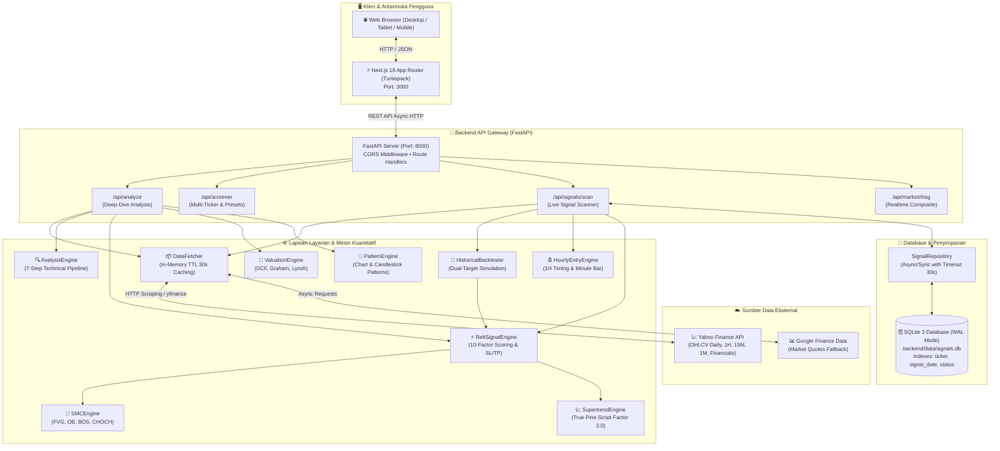
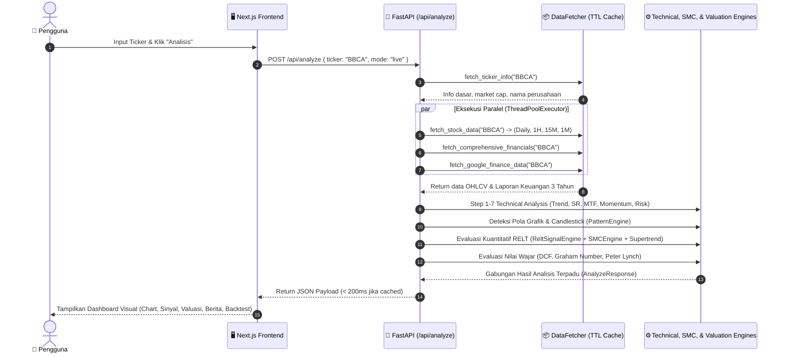
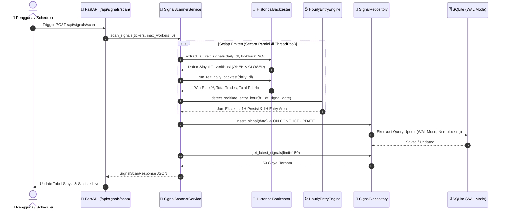

# 2. Arsitektur Sistem & Aliran Data (System Architecture & Data Flow)

Dokumen ini menjelaskan rancang bangun arsitektur tingkat tinggi (*high-level architecture*), aliran data end-to-end, pipeline analisis multi-tahap, mekanisme caching memori, dan konkurensi database pada **IDX Terminal**.

---

## 1. Diagram Arsitektur Tingkat Tinggi (High-Level Architecture)



---

## 2. Aliran Data Analisis Emiten Tunggal (`/api/analyze`)

Saat pengguna mengetik kode saham (misalnya `BBCA` atau `VKTR`) pada kotak pencarian, urutan eksekusi berlangsung sebagai berikut:



---

## 3. Aliran Pemindaian Sinyal Realtime (`/api/signals/scan`)

Pemindai sinyal live bursa beroperasi secara multi-threaded untuk memindai ratusan saham secara bersamaan:



---

## 4. Mekanisme In-Memory TTL Caching (`DataFetcher`)

Untuk mengatasi pembatasan laju (*rate limiting*) dari penyedia data eksternal dan memangkas latensi jaringan, `DataFetcher` mengimplementasikan *Time-To-Live (TTL) In-Memory Cache*:

- **Durasi TTL**: `30.0 detik`.
- **Kunci Cache (Cache Keys)**:
  - `info_{TICKER}`: Profil emiten, market cap, dan rasio PE/PBV.
  - `stock_{TICKER}`: DataFrame OHLCV lengkap (Daily, 1H, 15M, 1M).
  - `daily_{TICKER}`: DataFrame Daily OHLCV khusus screener.
  - `fin_{TICKER}`: Laporan keuangan 3 tahun & pertumbuhan CAGR.
- **Kebijakan Penggusuran (Eviction Policy)**: Saat `time.time() - ts > cache_ttl`, data kadaluarsa dihapus otomatis dari memori saat diakses kembali.

---

## 5. Arsitektur Konkurensi Database (SQLite WAL Mode)

Database `signals.db` dikonfigurasi secara khusus dengan mode **Write-Ahead Logging (WAL)**:

```sql
PRAGMA journal_mode = WAL;
PRAGMA synchronous = NORMAL;
PRAGMA cache_size = 10000;
```

### Keunggulan WAL Mode pada IDX Terminal:
1. **Pembaca Tidak Memblokir Penulis (Readers do not block Writers)**: UI dapat membaca daftar sinyal live tanpa jeda meskipun scanner sedang memperbarui ribuan baris di background.
2. **Penulis Tidak Memblokir Pembaca (Writers do not block Readers)**: Pemindaian live bursa berlangsung mulus tanpa memicu error `database is locked`.
3. **Peningkatan Performa I/O**: Operasi tulis disimpan ke berkas WAL terpisah sebelum digabungkan secara efisien (*checkpointing*).
