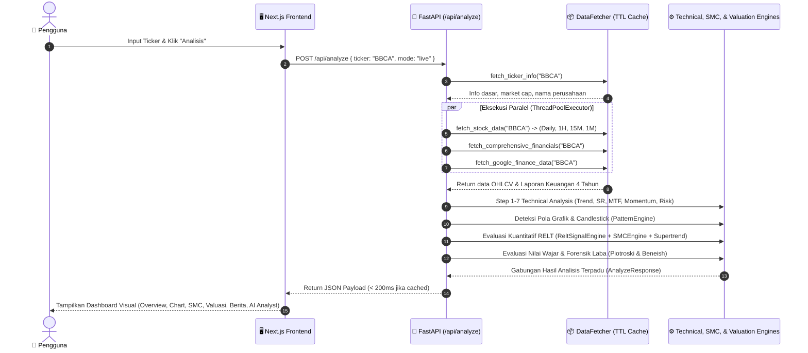
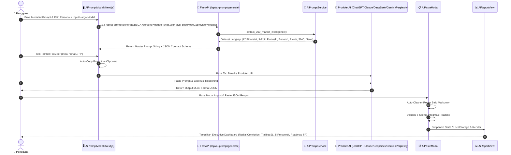
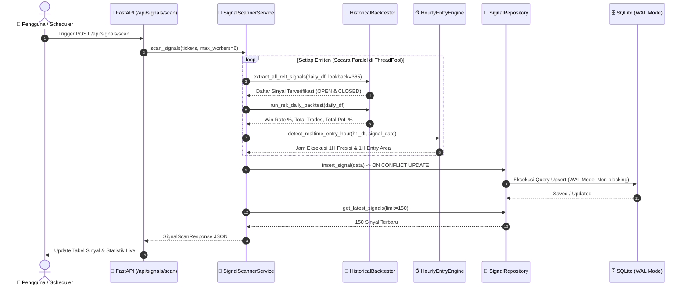

# 2. Arsitektur Sistem & Aliran Data (System Architecture & Data Flow)

Dokumen ini menjelaskan rancang bangun arsitektur tingkat tinggi (*high-level architecture*), aliran data end-to-end, pipeline analisis multi-tahap, integrasi orkestrasi AI, mekanisme caching memori, dan konkurensi database pada **IDX Terminal**.

---

## 1. Diagram Arsitektur Tingkat Tinggi (High-Level Architecture)

```mermaid
flowchart TB
    subgraph Clients["🖥️ Klien & Antarmuka Pengguna (Next.js 16 App Router)"]
        WebBrowser["🌐 Web Browser (Desktop / Tablet / Mobile)"]
        NextJS["⚡ Next.js 16 Turbopack (Port: 3000)<br/>App Router • React 19 • Glassmorphism"]
        WebBrowser <-->|HTTP / JSON| NextJS
    end

    subgraph FrontendComponents["🧩 Komponen Frontend & Modul Riset"]
        HeaderComp["Header & Stockbit Bridge<br/>(Header.js)"]
        OverviewComp["Overview & TopCards<br/>(TopCards.js, ReltSignalCard.js)"]
        AiPromptComp["AI Prompt Generator Modal<br/>(AiPromptModal.js)"]
        AiPasteComp["AI Importer & Live Schema Validator<br/>(AiPasteModal.js)"]
        AiReportComp["Executive Research Dashboard<br/>(AiReportView.js)"]
        ChartComp["TradingView Lightweight Charts v4<br/>(CandlestickChart.js)"]
    end

    NextJS --> HeaderComp
    NextJS --> OverviewComp
    NextJS --> AiPromptComp
    NextJS --> AiPasteComp
    NextJS --> AiReportComp
    NextJS --> ChartComp

    subgraph BackendGateway["🚀 Backend API Gateway (FastAPI Port: 8000)"]
        FastAPIApp["FastAPI Server<br/>CORS Middleware • Route Handlers • Pydantic V2"]
        AnalyzeEndpoint["/api/analyze<br/>(Deep-Dive Analysis)"]
        AiPromptEndpoint["/api/ai-prompt/generate<br/>(360° Prompt Extractor)"]
        ScreenerEndpoint["/api/screener<br/>(Multi-Ticker & Presets)"]
        SignalEndpoint["/api/signals/scan<br/>(Live Signal Scanner)"]
        MarketEndpoint["/api/market/ihsg & /api/price/{ticker}"]
        NewsEndpoint["/api/news/{ticker}"]
        
        FastAPIApp --> AnalyzeEndpoint
        FastAPIApp --> AiPromptEndpoint
        FastAPIApp --> ScreenerEndpoint
        FastAPIApp --> SignalEndpoint
        FastAPIApp --> MarketEndpoint
        FastAPIApp --> NewsEndpoint
    end

    NextJS <-->|REST API Async HTTP| FastAPIApp

    subgraph ServiceLayer["⚙️ Lapisan Layanan & Mesin Kuantitatif"]
        DataFetcher["📦 DataFetcher<br/>(In-Memory TTL 30s Caching)"]
        AiPromptService["🤖 AiPromptService<br/>(Piotroski, Beneish, Pivot, 4Y Fin)"]
        AnalysisEngine["🔍 AnalysisEngine<br/>(7-Step Technical Pipeline)"]
        ReltEngine["⚡ ReltSignalEngine<br/>(10-Factor Scoring & SL/TP)"]
        SMCEngine["🧠 SMCEngine<br/>(FVG, OB, BOS, CHOCH)"]
        SupertrendEngine["📈 SupertrendEngine<br/>(True Pine Script Factor 3.0)"]
        HourlyEngine["⏰ HourlyEntryEngine<br/>(1H Timing & Minute Bar)"]
        Backtester["🔄 HistoricalBacktester<br/>(Dual-Target Simulation)"]
        ValuationEngine["💎 ValuationEngine<br/>(DCF, Graham, Lynch, Forensics)"]
        PatternEngine["📐 PatternEngine<br/>(Chart & Candlestick Patterns)"]
    end

    AnalyzeEndpoint --> DataFetcher
    AnalyzeEndpoint --> AnalysisEngine
    AnalyzeEndpoint --> ReltEngine
    AnalyzeEndpoint --> ValuationEngine
    AnalyzeEndpoint --> PatternEngine

    AiPromptEndpoint --> DataFetcher
    AiPromptEndpoint --> AiPromptService
    AiPromptService --> SMCEngine
    AiPromptService --> ValuationEngine

    SignalEndpoint --> DataFetcher
    SignalEndpoint --> Backtester
    SignalEndpoint --> HourlyEngine
    SignalEndpoint --> ReltEngine

    ReltEngine --> SMCEngine
    ReltEngine --> SupertrendEngine
    Backtester --> ReltEngine

    subgraph ExternalSources["☁️ Sumber Data & Provider Eksternal"]
        YahooFinance["📈 Yahoo Finance API<br/>(OHLCV Daily, 1H, 15M, Financials)"]
        StockbitCommunity["💬 Stockbit IDX Platform<br/>(Direct Symbol Stream Bridge)"]
        AIProviders["🧠 External LLMs<br/>(ChatGPT, Claude, DeepSeek, Gemini, Perplexity)"]
    end

    DataFetcher <-->|HTTP Scraping / yfinance| YahooFinance
    HeaderComp -.->|1-Click External Tab| StockbitCommunity
    AiPromptComp -.->|1-Click Auto Copy & Launch| AIProviders
    AIProviders -.->|Paste JSON Output| AiPasteComp

    subgraph Persistence["💾 Database & Penyimpanan"]
        SQLiteDB[("🗄️ SQLite 3 Database (WAL Mode)<br/>backend/data/signals.db<br/>Indexes: ticker, signal_date, status")]
        SignalRepo["SignalRepository<br/>(Async/Sync with Timeout 30s)"]
        SignalEndpoint <--> SignalRepo
        SignalRepo <--> SQLiteDB
    end
```

---

## 2. Aliran Data Analisis Emiten Tunggal (`/api/analyze`)

Saat pengguna mengetik kode saham (misalnya `BBCA` atau `JATI`) pada kotak pencarian, urutan eksekusi berlangsung sebagai berikut:

---

## 3. Aliran Data AI Analyst & Executive Dashboard

---

## 4. Aliran Pemindaian Sinyal Realtime (`/api/signals/scan`)

Pemindai sinyal live bursa beroperasi secara multi-threaded untuk memindai ratusan saham secara bersamaan:

---

## 5. Mekanisme Caching Memori & Keandalan (TTL Cache)

1. **In-Memory TTL Cache (30 Detik)**:
   - Data pasar bursa (OHLCV) disimpan dalam cache memori dengan masa berlaku 30 detik untuk menghindari *rate-limiting* API eksternal dan menjamin latensi respon di bawah 20 milidetik saat multi-request.
2. **SQLite Write-Ahead Logging (WAL)**:
   - Pembacaan (*read*) dan penulisan (*write*) berjalan independen tanpa saling mengunci (*lock contention*).
   - Pengaturan `PRAGMA synchronous = NORMAL;` dan `PRAGMA busy_timeout = 5000;` memastikan pemindaian ratusan emiten tidak pernah mengalami database locked.
3. **Pemberhentian & Pembersihan Port Otomatis**:
   - Skrip launcher `run.bat` otomatis mendeteksi dan menghentikan proses lama pada port `:8000` dan `:3000` sebelum menyalakan server baru.
