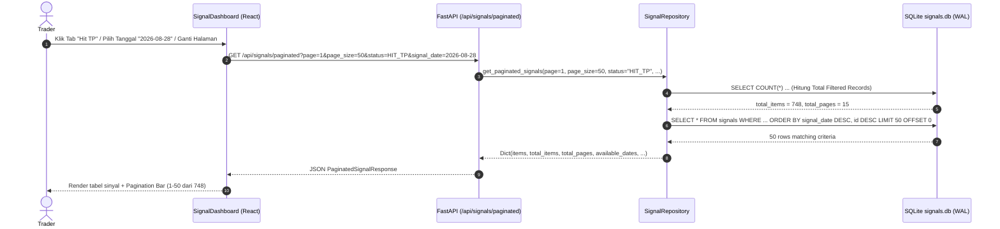

# 2. Arsitektur Sistem & Aliran Data (System Architecture & Data Flow)

Dokumen ini menjelaskan rancang bangun arsitektur tingkat tinggi (*high-level architecture*), aliran data end-to-end, pipeline analisis multi-tahap, integrasi orkestrasi AI, mekanisme caching memori, dan konkurensi database pada **IDX Terminal**.

---

## 1. Diagram Arsitektur Tingkat Tinggi (High-Level Architecture)

```mermaid
flowchart TB
    subgraph Clients["🖥️ Klien & Antarmuka Pengguna (Next.js 16 App Router)"]
        WebBrowser["🌐 Web Browser (Desktop / Tablet / Mobile)"]
        NextJS["⚡ Next.js 16 Turbopack (Port: 3000)<br/>App Router • React 19 • Anti-Slop Liquid Glass"]
        WebBrowser <-->|HTTP / JSON| NextJS
    end

    subgraph FrontendComponents["🧩 Komponen Frontend & Modul Riset"]
        HomeComp["Portal Beranda<br/>(2-Col Split Hero, 3D Radar, Clickable KPIs)"]
        SignalComp["Live Signal Radar Dashboard<br/>(Server-Side Pagination, Datepicker Filter)"]
        ScreenerComp["Stock Presets & Screener Hub<br/>(Multi-Ticker Screening)"]
        AnalysisComp["Deep-Dive Ticker Page<br/>(Header, Bento TopCards, Lightweight Charts)"]
        AiResearchComp["AI 360° Research Dashboard<br/>(Prompt Hub, Parser, Schema Validator)"]
    end

    NextJS --> HomeComp
    NextJS --> SignalComp
    NextJS --> ScreenerComp
    NextJS --> AnalysisComp
    NextJS --> AiResearchComp

    subgraph BackendGateway["🚀 Backend API Gateway (FastAPI Port: 8000)"]
        FastAPIApp["FastAPI Server<br/>CORS Middleware • Route Handlers • Pydantic V2"]
        AnalyzeEndpoint["/api/analyze<br/>(Deep-Dive Analysis)"]
        SignalPaginatedEndpoint["/api/signals/paginated & /api/signals/dates<br/>(Server-Side Pagination & Date Filter)"]
        SignalScanEndpoint["/api/signals/scan & /api/signals/stats<br/>(Multi-Worker Scanner & Aggr Stats)"]
        ScreenerEndpoint["/api/screener<br/>(Multi-Ticker & Presets)"]
        AiPromptEndpoint["/api/ai-prompt/generate<br/>(360° Master Prompt)"]
        MarketEndpoint["/api/market/ihsg & /api/price/{ticker}"]
        
        FastAPIApp --> AnalyzeEndpoint
        FastAPIApp --> SignalPaginatedEndpoint
        FastAPIApp --> SignalScanEndpoint
        FastAPIApp --> ScreenerEndpoint
        FastAPIApp --> AiPromptEndpoint
        FastAPIApp --> MarketEndpoint
    end

    NextJS <-->|REST API Async HTTP| FastAPIApp

    subgraph ServiceLayer["⚙️ Lapisan Layanan & Mesin Kuantitatif"]
        DataFetcher["📦 DataFetcher<br/>(In-Memory TTL 30s Caching)"]
        AnalysisEngine["🔍 AnalysisEngine<br/>(7-Step Technical Pipeline)"]
        ReltEngine["⚡ ReltSignalEngine<br/>(10-Factor Scoring & SL/TP)"]
        SMCEngine["🧠 SMCEngine<br/>(FVG, OB, BOS, CHOCH)"]
        HourlyEngine["⏰ HourlyEntryEngine<br/>(1H Timing & Minute Bar)"]
        Backtester["🔄 HistoricalBacktester<br/>(Dual-Target Simulation)"]
        SignalRepo["💾 SignalRepository<br/>(SQLite WAL, Pagination, Aggregates)"]
        
        AnalyzeEndpoint --> AnalysisEngine
        SignalPaginatedEndpoint --> SignalRepo
        SignalScanEndpoint --> SignalRepo
    end

    subgraph StorageLayer["🗄️ Lapisan Penyimpanan Data (Persistent Storage)"]
        SQLiteDB[("SQLite 3 Database (WAL Mode)<br/>backend/data/signals.db")]
        SignalRepo <-->|Parameterized SQL| SQLiteDB
    end
```

---

## 2. Alur Data Paginasi Server-Side & Datepicker

---

## 3. Optimasi Konkurensi & Caching

1. **In-Memory TTL Caching**: Data harga OHLCV di-cache selama 30 detik di `DataFetcher` untuk mencegah request berlebihan ke sumber data.
2. **Multi-Worker Concurrency**: Scanner sinyal menggunakan `concurrent.futures.ThreadPoolExecutor` (default 6 workers) untuk memproses ratusan emiten secara paralel.
3. **SQLite WAL Mode Non-Blocking**: Operasi pembacaan ribuan data di frontend tidak pernah terinterupsi saat worker scanner sedang melakukan batch insertion ke database.
