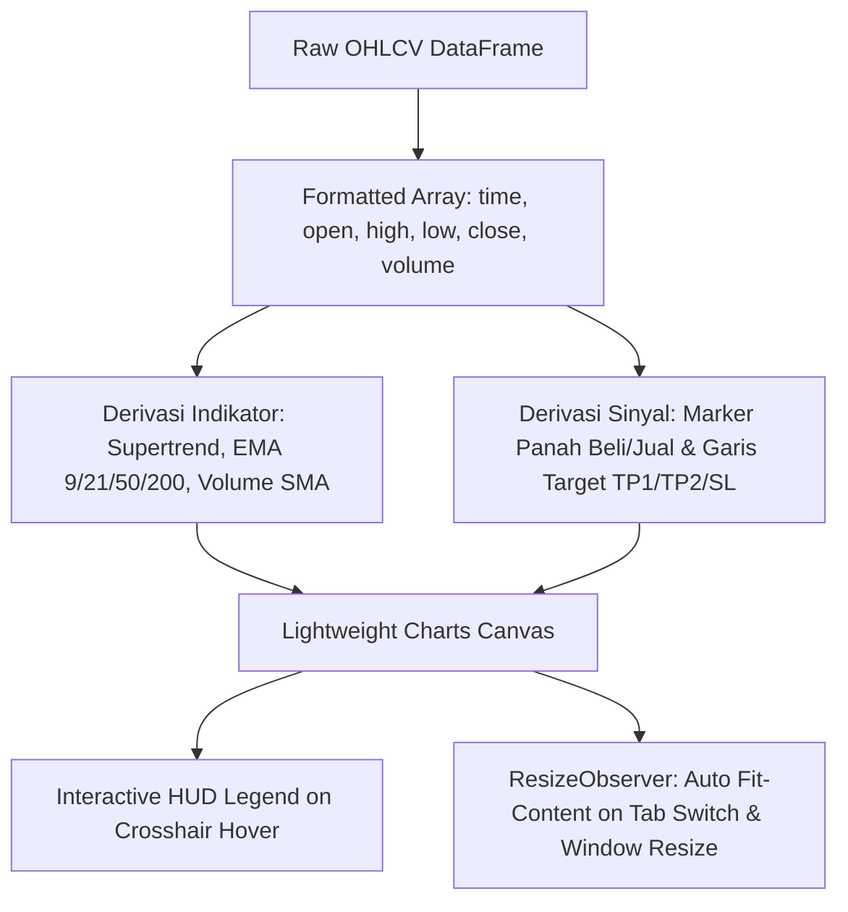

# 5. Frontend Design System & Charting Engine

Dokumen ini mendokumentasikan filosofi estetika, token desain, arsitektur komponen React/Next.js, sistem tipografi, serta integrasi mesin grafik (*Lightweight Charts & TradingView*) pada **IDX Terminal**.

---

## 1. Filosofi Desain: Liquid Glass / Dark Tech

Platform mengadopsi bahasa visual **Institutional Dark Tech** yang mengutamakan:
- **Tingkat Keterbacaan Finansial Tinggi (*High Contrast Readability*)**: Menggunakan font monospace tebal untuk angka nominal dan persentase sehingga data pasar mudah dicerna sekilas.
- **Glassmorphism Halus (*Subtle Frosted Glass*)**: Panel latar belakang dengan `backdrop-filter: blur(16px)` dan `background: rgba(15, 23, 42, 0.85)` memberikan kedalaman visual modern tanpa memperlambat rendering browser.
- **Color Coding Standar Finansial Pasar Modal**:
  - 🟢 **Bullish / Buy / Profit**: Emerald Green (`#10b981` / `rgba(74, 222, 128, 0.15)`)
  - 🔴 **Bearish / Sell / Loss**: Rose Red (`#f43f5e` / `rgba(244, 63, 94, 0.15)`)
  - 🟡 **Neutral / Warning / Wait**: Amber Gold (`#fbbf24` / `rgba(251, 191, 36, 0.15)`)
  - 🔵 **Info / Zone / Forecast**: Sky Blue (`#38bdf8` / `rgba(56, 189, 248, 0.15)`)

---

## 2. Struktur Token CSS (`globals.css`)

```css
:root {
  --bg-primary: #0a0c10;
  --bg-card: rgba(15, 17, 23, 0.85);
  --border-subtle: rgba(255, 255, 255, 0.08);
  --border-active: rgba(255, 255, 255, 0.18);
  
  --bullish: #4ade80;
  --bullish-bg: rgba(74, 222, 128, 0.12);
  --bearish: #f43f5e;
  --bearish-bg: rgba(244, 63, 94, 0.12);
  --warning: #fbbf24;
  --info: #60a5fa;

  --font-sans: 'Inter', system-ui, -apple-system, sans-serif;
  --font-mono: 'JetBrains Mono', 'Fira Code', monospace;
}
```

---

## 3. Arsitektur Halaman Utama (Next.js App Router)

```
frontend/src/app/
├── layout.js                 (Root Layout with Navbar, Market Time, Quick Search)
├── page.js                   (Home Portal: 2-Column Hero, IHSG Widget, Bento Cards, Preset Hub)
├── analysis/[ticker]/page.js (Deep-Dive Ticker Page with Sticky Sub-Tabs)
├── signals/page.js           (Live Signal Scanner Dashboard & Filtering)
├── screener/page.js          (Multi-Ticker Custom Screener)
└── learning/page.js          (8 Educational Knowledge Modules)
```

---

## 4. Mesin Grafik: Lightweight Charts & TradingView Integration

Komponen `CandlestickChart.js` memanfaatkan library **TradingView Lightweight Charts v4**:



### Fitur Utama Charting:
1. **Multi-Timeframe Switching**: Berpindah instan antara grafik **Harian (1D)**, **1-Jam (1H)**, dan **15-Menit (15M)** tanpa memuat ulang halaman.
2. **Dynamic Overlay Layers**:
   - Supertrend: Garis hijau tebal untuk tren naik (*Bullish*) dan garis merah untuk tren turun (*Bearish*).
   - EMA Ribbon: EMA 9 (Kuning), EMA 21 (Biru), EMA 50 (Ungu), EMA 200 (Putih).
   - SMC Areas: Kotak hijau transparan untuk *Bullish Fair Value Gap* dan kotak merah untuk *Bearish FVG*.
   - Target Rays: Garis putus-putus untuk Entry, Stop Loss, Target TP1 (1.5R), dan Target TP2 (2.5R).
3. **Signal Markers**: Pin panah hijau bertuliskan harga eksekusi beli historis dan pin panah merah saat TP/SL tersentuh.
4. **`ResizeObserver`**: Memastikan canvas grafik selalu ter-render dengan lebar 100% sempurna saat pengguna berpindah tab tanpa *flicker*.
