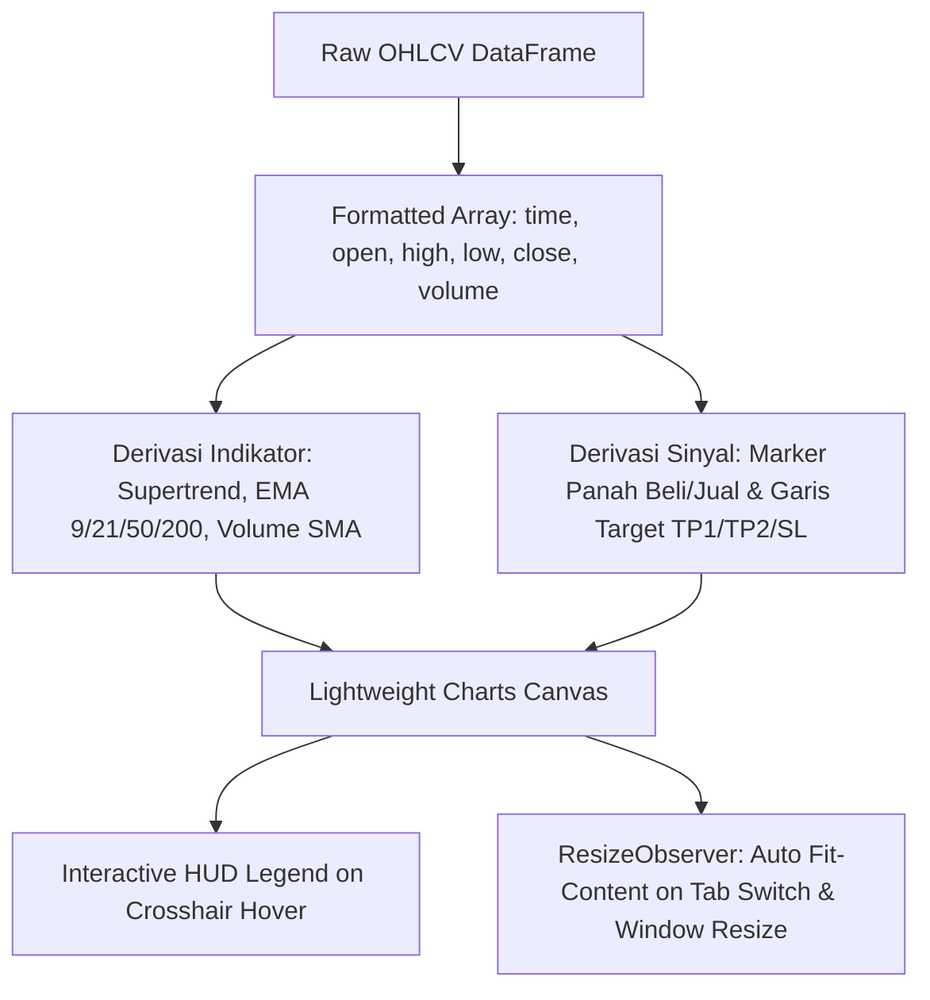

# 5. Frontend Design System & Charting Engine

Dokumen ini mendokumentasikan filosofi estetika, token desain, arsitektur komponen React/Next.js, sistem tipografi, integrasi mesin grafik (*Lightweight Charts*), serta komponen antarmuka eksekutif **AI Analyst** pada **IDX Terminal**.

---

## 1. Filosofi Desain: Liquid Glass / Dark Tech

Platform mengadopsi bahasa visual **Institutional Dark Tech** yang mengutamakan:
- **Tingkat Keterbacaan Finansial Tinggi (*High Contrast Readability*)**: Menggunakan font monospace tebal untuk angka nominal dan persentase sehingga data pasar mudah dicerna sekilas.
- **Glassmorphism Halus (*Subtle Frosted Glass*)**: Panel latar belakang dengan `backdrop-filter: blur(16px)` dan `background: rgba(15, 23, 42, 0.88)` memberikan kedalaman visual modern tanpa memperlambat rendering browser.
- **Color Coding Standar Finansial Pasar Modal**:
  - 🟢 **Bullish / Buy / Profit**: Emerald Green (`#10b981` / `#4ade80` / `rgba(74, 222, 128, 0.15)`)
  - 🔴 **Bearish / Sell / Loss**: Rose Red (`#f43f5e` / `rgba(244, 63, 94, 0.15)`)
  - 🟡 **Neutral / Warning / Wait**: Amber Gold (`#fbbf24` / `rgba(251, 191, 36, 0.15)`)
  - 🔵 **Info / Zone / Forecast**: Sky Blue (`#38bdf8` / `#60a5fa` / `rgba(56, 189, 248, 0.15)`)
  - 🌐 **Stockbit Community**: Mint Emerald (`#34d399` / `rgba(16, 185, 129, 0.12)`)

---

## 2. Struktur Token CSS (`globals.css`)

```css
:root {
  --bg-primary: #0a0c10;
  --bg-card: rgba(15, 17, 23, 0.85);
  --border-subtle: rgba(255, 255, 255, 0.08);
  --border-active: rgba(255, 255, 255, 0.18);
  
  --bullish: #4ade80;
  --bullish-bg: rgba(74, 222, 128, 0.12);
  --bearish: #f43f5e;
  --bearish-bg: rgba(244, 63, 94, 0.12);
  --warning: #fbbf24;
  --info: #60a5fa;
  --stockbit: #34d399;

  --font-sans: 'Inter', system-ui, -apple-system, sans-serif;
  --font-mono: 'JetBrains Mono', 'Fira Code', monospace;
}
```

---

## 3. Arsitektur Komponen & Halaman (Next.js App Router)

```
frontend/src/
├── app/
│   ├── layout.js                 (Root Layout with Navbar, Market Time, Quick Search)
│   ├── page.js                   (Home Portal: 2-Column Hero, IHSG Widget, Bento Cards, Preset Hub)
│   ├── analysis/[ticker]/page.js (Deep-Dive Ticker Page with Sticky Sub-Tabs)
│   ├── signals/page.js           (Live Signal Scanner Dashboard & Filtering)
│   ├── screener/page.js          (Multi-Ticker Custom Screener)
│   └── learning/page.js          (8 Educational Knowledge Modules)
├── components/
│   ├── Header.js                 (Price Header, Profile Drawer & Adaptive Stockbit Bridge)
│   ├── TopCards.js               (Bento Grid: Setup Score, SMC Phase, Primary Trend, Break Level)
│   ├── CandlestickChart.js       (TradingView Lightweight Charts Canvas with ResizeObserver)
│   ├── FinancialCard.js          (4-Year Financial History, DCF, Graham Number, Valuation Tabs)
│   ├── ai/
│   │   ├── AiPromptModal.js      (3-Step Flow: Personas, Portfolio Avg Price, Dataset Badges, 5 Providers)
│   │   ├── AiPasteModal.js       (Auto-Cleaner, 6 Schema Integrity Badges, 1-Click Clipboard & Demo Loader)
│   │   ├── AiReportView.js       (Hero Verdict, Radial SVG Conviction Meter 0-100, Trailing SL, 5-Perspective Tabs)
│   │   └── AiHistoryDrawer.js    (LocalStorage Historical Analysis Logs & Importer)
│   └── CategoryPresetHub.js      (Market Presets: LQ45, High Dividend, BPJS, BSJP 15:30)
└── utils/
    ├── aiPromptGenerator.js      (Client-side Dynamic Prompt Builder & Sample Dataset)
    └── formatters.js             (Indonesian Currency, Lot Sizing, & Percentage Math)
```

---

## 4. Komponen Antarmuka AI Analyst (`src/components/ai/`)

### A. `AiPromptModal.js` (Generator Prompt Cerdas)
- **Langkah 1**: Horizontal Segmented Pills untuk pemilihan persona analis dan form input modal beli (*Average Price*) dengan penghitung *Realtime Floating PnL*.
- **Langkah 2**: 5 Chip ringkasan intelijen emiten (*Finansial 4-Tahun, 9-Poin Piotroski/Beneish, SMC Order Blocks, Pivot Levels, dan 15 Berita*).
- **Langkah 3**: 5 Tombol 1-klik dengan logo bersih (*ChatGPT, Claude, DeepSeek, Google Gemini, Perplexity*) yang otomatis menyalin prompt dan membuka tab baru.

### B. `AiPasteModal.js` (Importer & Validator Skema)
- **6 Badge Integritas Skema Real-Time**:
  1. `Meta Data` (Ticker, Model, Analisis)
  2. `Executive Verdict` (Conviction, Bias, Action, Thesis)
  3. `5 Perspectives` (SMC, Bandarmologi, Kuantitatif, Valuasi, Eksekusi)
  4. `Scenario Matrix` (Bullish, Bearish Invalidation, Sideways)
  5. `Execution Blueprint` (Entry Zones, Stop Loss, Multi-Tier TP)
  6. `Portfolio Context` (Status Modal, Trailing SL, Averaging Strategy)
- **Aksi Cepat**: Tombol *Paste dari Clipboard* dan *Muat Contoh Demo*.

### C. `AiReportView.js` (Dashboard Eksekutif Standar Institusi)
- **Radial SVG Conviction Meter (0-100)**: Kalkulasi sudut rotasi dan keliling lingkaran dinamis:
  $$\text{StrokeDashoffset} = C - \left(\frac{\text{Score}}{100} \times C\right), \quad C = 2\pi r$$
- **Personalized Strategy Card**: Tampil jika ada data modal beli; menyajikan floating profit/loss, trailing stop, dan rencana averaging.
- **5-Perspective Tabbed Explorer**: Segmented navigation untuk menjelajahi SMC, Order Flow, Kuantitatif, Valuasi, dan Eksekusi.
- **Asymmetric Scenario Matrix**: 3 kartu probabilitas skenario pasar (Bullish, Bearish, Sideways).

---

## 5. Mesin Grafik: Lightweight Charts v4

Komponen `CandlestickChart.js` memanfaatkan library **TradingView Lightweight Charts v4**:



### Fitur Utama Charting:
1. **Multi-Timeframe Switching**: Berpindah instan antara grafik **Harian (1D)**, **1-Jam (1H)**, dan **15-Menit (15M)** tanpa reload.
2. **Dynamic Overlay Layers**:
   - Supertrend: Garis hijau tebal (*Bullish*) dan garis merah (*Bearish*).
   - EMA Ribbon: EMA 9, EMA 21, EMA 50, EMA 200.
   - SMC Areas: Kotak hijau transparan untuk *Bullish Fair Value Gap* dan kotak merah untuk *Bearish FVG*.
   - Target Rays: Garis horizontal untuk Entry, Stop Loss, TP1 (1.5R), dan TP2 (2.5R).
3. **Signal Markers**: Pin panah hijau bertuliskan harga beli dan pin merah saat TP/SL tersentuh.
4. **`ResizeObserver`**: Memastikan canvas grafik selalu ter-render dengan lebar 100% sempurna saat berganti tab tanpa distorsi.
