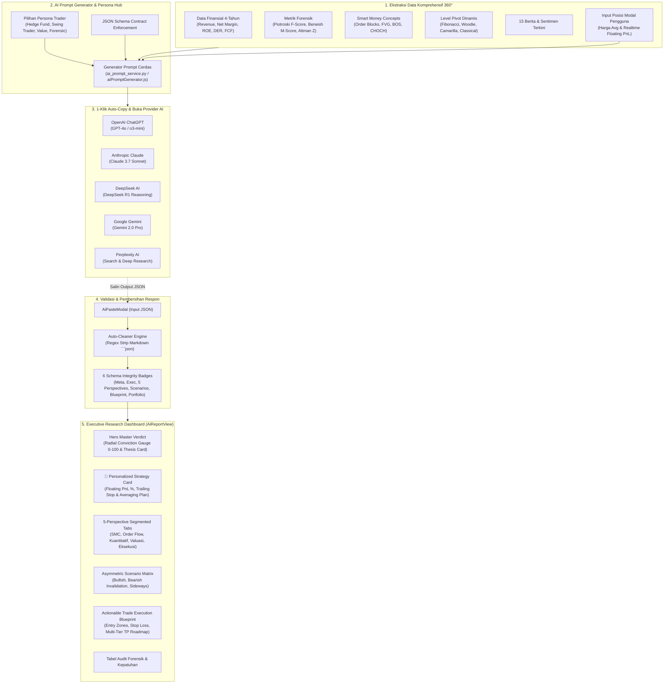

# 8. AI Market Intelligence & Prompt Engineering Engine

> **Arsitektur Ekstraksi Intelijen Pasar 360°, Generator Prompt Multi-Persona, Integrasi 5 Provider AI, Validasi Integritas Skema JSON, dan Dashboard Riset Eksekutif Standar Institusi.**

---

## 🌟 1. Gambaran Umum (Executive Overview)

Modul **AI Analyst Engine** di dalam **IDX Terminal** dirancang untuk menjembatani data kuantitatif pasar saham Indonesia (BEI / IDX) dengan kemampuan penalaran mendalam (*deep reasoning*) dari model bahasa besar (*Large Language Models*) terkemuka di dunia. 

Alih-alih memberikan data dangkal atau ringkasan sederhana, engine ini mengekstrak **100% data kuantitatif komprehensif** (finansial 4-tahun, 9-poin Piotroski F-Score, 8-variabel Beneish M-Score, Altman Z-Score, level pivot multi-metode, order block Smart Money Concepts, dan 15 berita terkini), lalu meramunya ke dalam struktur prompt terstandarisasi yang menghasilkan keluaran **JSON terstruktur murni**. 

Keluaran JSON tersebut kemudian diimpor kembali ke IDX Terminal untuk dirender menjadi **Executive Research Dashboard** interaktif dengan visualisasi radial keyakinan institusi, roadmap eksekusi bertahap, dan checklist audit forensik.

---

## 🏛️ 2. Alur Kerja Sistem (End-to-End Workflow)



---

## 🧩 3. Komponen Ekstraksi Data 360° (360° Intelligence Extractor)

Saat pengguna membuka modal **AI Prompt**, sistem mengagregasi seluruh dataset emiten secara realtime:

| Kategori Data | Parameter yang Diekstrak | Tujuan Analisis LLM |
| :--- | :--- | :--- |
| **Finansial 4-Tahun** | Revenue, Net Income, Net Margin, EPS, ROE, ROA, DER, PBV, PER, Free Cash Flow. | Mengukur stabilitas tren pertumbuhan jangka panjang dan siklus laba bersih. |
| **Audit Forensik Laba** | 9-Poin Piotroski F-Score (0-9), 8-Variabel Beneish M-Score, Altman Z-Score Bankruptcy Model, DuPont 3-Way ROE Decomposition. | Mendeteksi potensi rekayasa laporan keuangan (*earnings manipulation*) dan risiko kebangkrutan. |
| **Smart Money Concepts** | Bullish & Bearish Order Blocks (OB), Fair Value Gaps (FVG), Break of Structure (BOS), Change of Character (CHOCH), Liquidity Sweeps. | Mengidentifikasi jejak akumulasi/distribusi uang pintar (*institutional footprint*). |
| **Level Pivot Dinamis** | Level Pivot Fibonacci (R1-R3, S1-S3), Woodie Pivot, Camarilla Equation (H3-H4, L3-L4), dan Classic Floor Pivot. | Menentukan zona batas reaksi harga harian dan intraday. |
| **Kuantitatif & Momentum** | Skor RELT 10-Faktor (0-100), Supertrend 1D & 1H, RSI (14), MACD Histogram, EMA Ribbon (9, 21, 50, 200), ATR Volatility Band. | Mengukur kekuatan momentum dan filter rezim tren makro. |
| **Berita & Sentimen** | 15 judul berita bursa terkini, ringkasan sentimen artikel, dan keterbukaan informasi emiten. | Memvalidasi katalis fundamental eksternal dan sentimen pasar. |
| **Konteks Portofolio** | Harga beli rata-rata (*Average Price*) pengguna, Floating PnL realtime (Rp & %), dan status posisi modal. | Menghasilkan rekomendasi tindakan personal (*Hold, Average Down, Take Profit, Trailing Stop*). |

---

## 🎭 4. Persona Analisis yang Didukung

Pengguna dapat memilih salah satu dari 4 persona analis profesional:

1. **🏛️ Institutional Hedge Fund (Default)**:
   - *Fokus*: Manajemen risiko asimetris (*Reward-to-Risk $\ge 2.5$*), likuiditas institusi, dan proteksi modal terukur.
2. **⚡ Swing & Momentum Trader**:
   - *Fokus*: *Momentum surge*, *pullback confirmation* pada EMA/Order Block, dan target Take Profit cepat (1–10 hari).
3. **💎 Deep Value & Quality Investor**:
   - *Fokus*: Margin of Safety, DCF Fair Value, Graham Number, konsistensi laba 4-tahun, dan dividend yield.
4. **🔍 Forensic Accounting & Short/Risk Auditor**:
   - *Fokus*: Deteksi anomali akrual, Beneish M-Score red flags, Piotroski deterioration, dan beban utang jatuh tempo.

---

## 🌐 5. Integrasi 5 Provider AI (1-Click Hub)

Tombol peluncur otomatis telah dikonfigurasi untuk langsung menyalin prompt ke clipboard dan membuka URL workspace resmi provider AI terkait:

| Provider AI | Model Rekomendasi | Direct Workspace URL |
| :--- | :--- | :--- |
| **ChatGPT** | GPT-4o / o3-mini | `https://chatgpt.com/` |
| **Claude** | Claude 3.7 Sonnet (Thinking Mode) | `https://claude.ai/new` |
| **DeepSeek** | DeepSeek R1 (Deep Reasoning) | `https://chat.deepseek.com/` |
| **Google Gemini** | Gemini 2.0 Pro / Flash | `https://gemini.google.com/app` |
| **Perplexity** | Deep Research / Pro Search | `https://www.perplexity.ai/` |

> [!NOTE]
> Pada prompt yang disalin, instruksi model diformulasikan secara dinamis sesuai provider yang diklik pengguna, contohnya: `"ai_provider_model": "Tentukan nama model yang kamu gunakan seperti GPT-4o / o3-mini / atau yang lain"`.

---

## 📋 6. Spesifikasi Kontrak Skema JSON Output

LLM diinstruksikan untuk mengembalikan respon **murni dalam format JSON** tanpa teks pembuka atau penutup:

```json
{
  "meta": {
    "ticker": "BBCA",
    "company_name": "Bank Central Asia Tbk",
    "current_price": 10250,
    "analysis_date": "2026-08-31",
    "persona_used": "Institutional Hedge Fund",
    "ai_provider_model": "ChatGPT (GPT-4o)"
  },
  "executive_summary": {
    "conviction_score": 88,
    "master_bias": "STRONG_BULLISH",
    "primary_action": "PULLBACK_BUY",
    "one_sentence_thesis": "Fundamental defensif berpadu dengan akumulasi order block 1H pada level Rp10.100 memberikan rasio reward-to-risk 3.2x yang sangat menarik.",
    "key_catalysts": [
      "Pertumbuhan kredit 12.5% YoY melampaui rata-rata industri",
      "Kualitas aset prima dengan NPL gross di bawah 1.8%",
      "Arus dana asing mencatatkan net buy konsisten 5 hari terakhir"
    ],
    "key_risks": [
      "Tekanan suku bunga acuan global yang berpotensi membatasi margin bunga bersih (NIM)",
      "Ketidakpastian geopolitik global yang dapat memicu volatilitas nilai tukar Rupiah"
    ]
  },
  "portfolio_context": {
    "user_avg_price": 9800,
    "floating_pnl_pct": 4.59,
    "position_status": "PROFIT_PROTECTION",
    "personalized_action": "HOLD & TRAILING STOP",
    "custom_invalidation_level": 10050,
    "custom_take_profit_target": 11200,
    "averaging_strategy": "Jangan tambah posisi di atas Rp10.300; geser stop loss ke Rp10.050 untuk mengunci profit minimal +2.5%."
  },
  "perspectives": {
    "price_action_smc": {
      "score": 90,
      "status": "STRONG_BULLISH",
      "findings": "Struktur harga mencetak Higher High dengan Bullish Order Block aktif di Rp10.100 - Rp10.175.",
      "key_metrics": {
        "market_structure": "BULLISH_BOS",
        "key_order_block": "Rp10.100 - Rp10.175",
        "liquidity_pool": "Rp10.500 (Buy-side Liquidity)"
      }
    },
    "bandarmology_order_flow": {
      "score": 85,
      "status": "ACCUMULATION",
      "findings": "Top 3 broker pembeli mendominasi 62% volume transaksi dengan pola akumulasi rapi.",
      "key_metrics": {
        "flow_regime": "BIG_ACCUMULATION",
        "foreign_flow": "NET_BUY_150B",
        "buyer_concentration": "62% by Top 3 Brokers"
      }
    },
    "quantitative_momentum": {
      "score": 82,
      "status": "HEALTHY_MOMENTUM",
      "findings": "RSI di 62.4 berada di zona ekspansi tanpa kondisi overbought ekstrem, didukung MACD golden cross.",
      "key_metrics": {
        "rsi_14": "62.4 (Expansion Zone)",
        "macd_status": "Bullish Histogram Expanding",
        "supertrend_regime": "BULLISH"
      }
    },
    "fundamental_valuation": {
      "score": 92,
      "status": "HIGH_QUALITY_UNDERVALUED",
      "findings": "Piotroski F-Score sempurna (9/9) dan Beneish M-Score (-2.95) menegaskan kualitas laba yang sangat sehat.",
      "key_metrics": {
        "piotroski_f_score": "9/9 (Pristine)",
        "beneish_m_score": "-2.95 (No Manipulation Risk)",
        "consensus_fair_value": "Rp11.450 (Upside +11.7%)"
      }
    },
    "risk_reward_execution": {
      "score": 88,
      "status": "OPTIMAL_SETUP",
      "findings": "Stop loss terdefinisi ketat di Rp9.950 dengan TP2 di Rp11.200 menghasilkan RR 3.16x.",
      "key_metrics": {
        "reward_to_risk": "3.16x",
        "max_risk_pct": "2.93%",
        "recommended_timeframe": "1-3 Minggu (Swing Trade)"
      }
    }
  },
  "scenario_matrix": {
    "primary_bullish": {
      "probability_pct": 65,
      "trigger_condition": "Bertahan di atas Order Block Rp10.100 pada penutupan sesi 1",
      "price_target": 11200,
      "expected_timeframe": "2-4 Minggu"
    },
    "alternative_bearish": {
      "probability_pct": 20,
      "invalidation_trigger": "Penutupan harian tembus di bawah Rp9.950 dengan volume tinggi",
      "downside_target": 9600,
      "action_if_triggered": "Cut Loss / Exit Total"
    },
    "sideways_consolidation": {
      "probability_pct": 15,
      "range_low": 10050,
      "range_high": 10400,
      "playbook": "Range Trade: Beli dekat Rp10.050, jual bertahap di Rp10.375"
    }
  },
  "execution_blueprint": {
    "action": "BUY_ON_PULLBACK",
    "entry_zones": {
      "primary_entry": 10150,
      "secondary_pullback_entry": 10075
    },
    "stop_loss": {
      "price": 9950,
      "risk_percentage": 1.97,
      "invalidation_reason": "Di bawah Swing Low & Invalidasi Order Block 1H"
    },
    "take_profit_levels": {
      "tp1": { "price": 10550, "gain_pct": 3.94, "action": "Amankan 50% porsi & geser SL ke BEP (+0.5%)" },
      "tp2": { "price": 10900, "gain_pct": 7.39, "action": "Amankan 30% porsi (Runner)" },
      "tp3": { "price": 11450, "gain_pct": 12.81, "action": "Target Konsensus Nilai Wajar DCF (Exit Total)" }
    },
    "position_sizing_advice": "Alokasikan maksimal 10% - 15% dari total portofolio dengan toleransi risiko modal 1%."
  },
  "forensic_checklist": [
    { "aspect": "Kualitas Laba (Beneish M-Score)", "status": "PASS", "details": "Skor -2.95 berada jauh di bawah ambang batas bahaya -1.78." },
    { "aspect": "Kekuatan Finansial (Piotroski F-Score)", "status": "PASS", "details": "Skor 9/9 mengonfirmasi perbaikan profitabilitas dan likuiditas." },
    { "aspect": "Tingkat Solvabilitas & Utang (DER)", "status": "PASS", "details": "Rasio kecukupan modal (CAR) perbankan di atas 25%." },
    { "aspect": "Struktur Tren Makro", "status": "PASS", "details": "Harga berada di atas seluruh moving average harian." }
  ]
}
```

---

## 📊 7. Visualisasi & Desain Dashboard Eksekutif (`AiReportView.js`)

Dashboard eksekutif dibangun menggunakan token warna harmonis (*dark glassmorphism*) dengan komponen UI tingkat tinggi:

1. **Radial SVG Conviction Score Meter**: Lingkaran progress glowing interaktif yang memetakan skor keyakinan dari `0` hingga `100`.
2. **Master Bias Ribbon**: Penanda status pasar dominan (*STRONG BULLISH / BULLISH / NEUTRAL / BEARISH*).
3. **One-Sentence Thesis Card**: Kartu kutipan tesis investasi dengan aksen garis kiri berwarna dinamis.
4. **Personalized Portfolio Strategy Banner**: Tampil otomatis jika pengguna memasukkan modal harga beli, menyajikan persentase floating profit/loss, rekomendasi taktis personal, level trailing stop, dan rencana averaging.
5. **Interactive 5-Perspective Tabbed Explorer**: Navigasi tab interaktif untuk meneliti temuan pada SMC, Bandarmologi, Kuantitatif, Valuasi Forensik, dan Manajemen Risiko.
6. **Asymmetric Scenario Matrix**: 3 kartu skenario (Bullish, Bearish, Sideways) dengan persentase probabilitas, pemicu konfirmasi, dan target harga.
7. **Actionable Trade Blueprint**: Rencana eksekusi bertahap (Zona Masuk 1 & 2, Proteksi SL, dan Multi-Tier TP Roadmap).
8. **Forensic Health Checklist**: Tabel kepatuhan fundamental dengan status pill `PASS` / `FAIL`.
9. **Raw JSON Inspector**: Accordion untuk menginspeksi atau menyalin raw JSON sewaktu-waktu.
